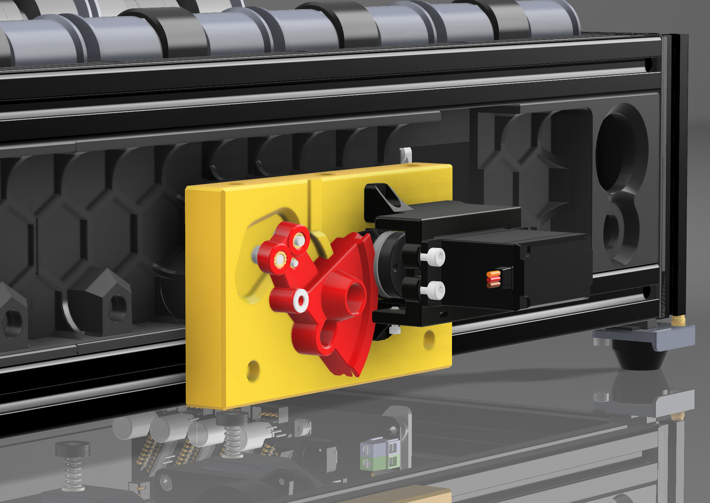
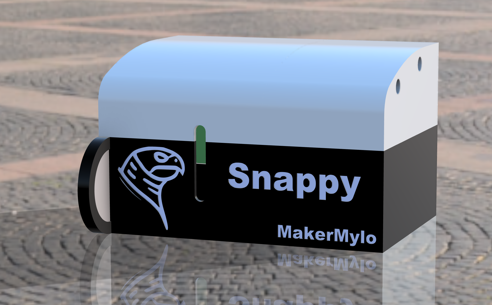

Snappy Mod aka Snapping Turtle
===
This is a modification for BoxTurtle based on the fantastic [EREC Cutter](https://github.com/kevinakasam/ERCF_Filament_Cutter) by [KevinAKASam](https://kevinakasam.com/).



Assembly
===
1. Follow the manual on the EREC project to build the cutter, the only difference is where it mounts.

2. You can then fix it to your BoxTurtle using 3x M3x16 and 3xM3 Roll/Drop Nuts.

3. Poke your PTFE tube through the cutter hole before attaching the blade holder and cut it flush with the face, on mine this was 16.3mm long.

4. Do not remove the ECAS from your hub, this holds the PTFE in place.



Lid Assembly
===
1. Add 2x M3 5x5x4 Heatset Inserts to the SnappyLidA Part.

2. Add 2x M3x20 (SHCS Works) Screws into SnappyLidB and screw the 2 halves together.

3. Add 3x 6x3 Magnets to the inside of the lid if needed (For me they weren't, it was a nice friction fit).

4. Add 4x 6x3 Magnets to the bottom of the lid to hold the tray.

5. Add 4x 6x3 Magnets to the Tray (Ensuring they are oriented correctly to attract to the lid magnets).

Config
===
This assumes you're using Snappy with AFC and using an MG996R Servo.

`AFC_Hardware.cfg`
Ensure you have a Servo named 'cut' defined in your AFC Hardware file like so:
```
[servo cut]
pin: AFC:PA13               # Correct Pin for MMB
maximum_servo_angle: 180  	# Set this to 60 for a 60° Servo
minimum_pulse_width: 0.0005	# Adapt these for your servo
maximum_pulse_width: 0.0025	# Adapt these for your servo
```

`AFC.cfg`
Ensure that your AFC Config file has the correct hub_cut settings, like so:
```
# HUB Cutting Settings
hub_cut_active: True
hub_cut_dist: 15               # How much filament to cut off (in mm).
hub_cut_clear: 75              # How far the filament should retract back from the hub (in mm).
hub_cut_min_length: 300.0
hub_cut_servo_pass_angle: 10    # Servo angle to align the Bowden tube with the hole for loading the toolhead.
hub_cut_servo_clip_angle: 180   # Servo angle for cutting the filament.
hub_cut_servo_prep_angle: 340    # Servo angle to prepare the filament for cutting (aligning the exit hole).
```
And as a safety measure, add `SET_SERVO SERVO=cut ANGLE=10` at the very bottom of the file under the `[delayed_gcode welcome]` section, after `PREP`, this will ensure the servo is always in the correct spot on boot.

Bill of Materials
===
Every link in the Bill of Materials is an affiliate link, This costs you nothing to use but helps buy me some filament and trinkets to make this kind of mod.

- **Full** EREC Filament Cutter BOM Kit: [AE Link](https://s.click.aliexpress.com/e/_DBtMz8X)
- Optionally you can also use a more powerful servo, I recommend this one: [AE Link](https://s.click.aliexpress.com/e/_DDc9vRH), Requires the 15mm Servo Hub file.

Upcoming Changes
===
 - ~~Filament Tip Collection Drawer~~ - DONE
 - ~~Hood that covers the cutter to prevent tips firing off.~~ - DONE

Extra Thanks To
===
Discord User @Blamm for the 15mm Hub STL.

Contribute
===
Got a mod you'd like to see in the repo? Hit me up on Discord (@MakerMylo) and i'll gladly add it for you.

Thank Me
===
A few ways you can show your appreciation for my work:\
[Buy Me a Coffee](https://buymeacoffee.com/makermylo) | [Subscribe on YouTube](https://www.youtube.com/@makermylo) | [Follow on X](https://x.com/MakerMylo)
